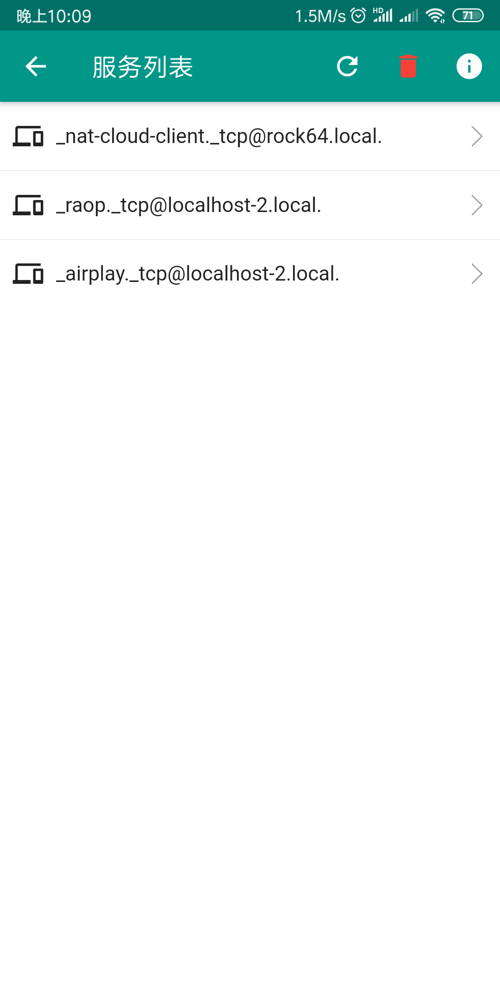
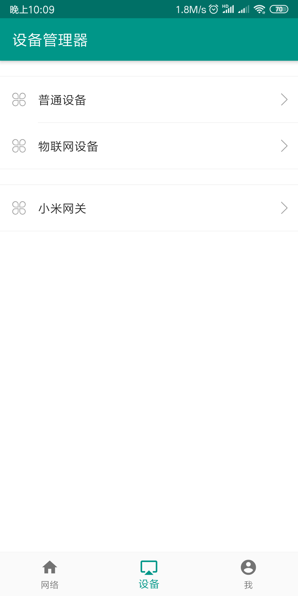
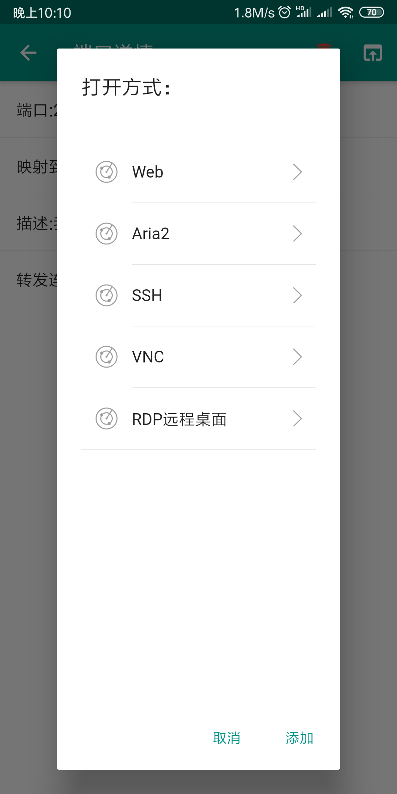

# 安卓访问端
###### 与其它版本兼容
#### 下载地址：
  * 安卓版：https://github.com/nat-cloud/android-explorer/releases
  * 其他版本：https://github.com/nat-cloud/explorer/releases
#### 内网生成访问码工具的下载地址:  
  * 安卓版：https://github.com/nat-cloud/android-client/releases  
  * 其他版本：https://github.com/nat-cloud/client/releases  
> 自建转发服务器下载（高阶）：
> * https://github.com/nat-cloud/server/releases
> * 服务器请自行配置端口和秘钥，内网端使用你配置的信息和公网地址就可以使用自建服务器
#### 教程：
  * 简书：https://www.jianshu.com/u/b312a876d66e
#### 支持的功能：
- [x] 1.支持搜索内网端
- [x] 2.支持配置保存，下一次启动直接加载之前的旧配置
- [x] 3.支持直接打开内网的网站端口
- [x] 4.支持直接使用内网的aria2离线下载
- [x] 5.支持直接访问内网的ssh的终端
- [x] 6.支持通过内网ssh访问机器的文件（上传下载）
- [x] 7.支持直接打开内网机器的vnc桌面
- [x] 8.支持调用手机RD Client打开内网windows的桌面
- [x] 9.支持映射ftp协议
- [x] 10.网络开机（WOL）
- [ ] 11.直接备份通讯录到私有云
#### A new Flutter application of natcloud explorer.  
  * 远程网络列表

  * 内网由mDNS声明的服务

  * 设备管理器

  * 设备列表

  * 普通设备的服务

  * 普通设备的TCP服务

  * TCP端口打开方式

  * 我

## Getting Started

This project is a starting point for a Flutter application.

A few resources to get you started if this is your first Flutter project:

- [Lab: Write your first Flutter app](https://flutter.io/docs/get-started/codelab)
- [Cookbook: Useful Flutter samples](https://flutter.io/docs/cookbook)

For help getting started with Flutter, view our 
[online documentation](https://flutter.io/docs), which offers tutorials, 
samples, guidance on mobile development, and a full API reference.
